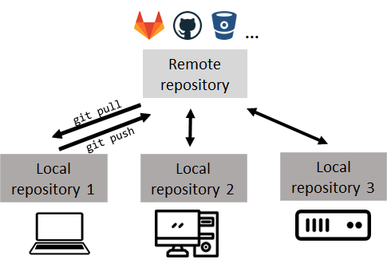

# How to use git




```bash

# get help for a command
git <command> --help

# start a repository
git init
git clone <address>

# show the working tree status
git status

# add a file
git add <filename>

# add everything
git add .

# make a commit
git commit -m "commit message"

# push all commits to the remote repository
git pull

# get all commits from the remote repository
git push


#### Working with branches
# show all branches
git branch

# create a new branch
git branch <branchname>

# change the current branch (commit everything before doing this!)
git switch <branchname>

# merge another branch into the master branch (do it when you are at the master branch)
# it is possible that you have to resolve merge conflicts!
git merge <branchname>

# Apply all the commits of the master branch in <branchname>,
# do it after you have merged you branch
git rebase master <branchname>

# Delete a branch
git branch -d <branchname>
```
